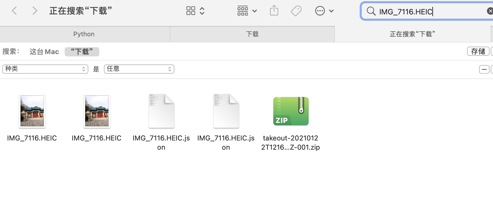
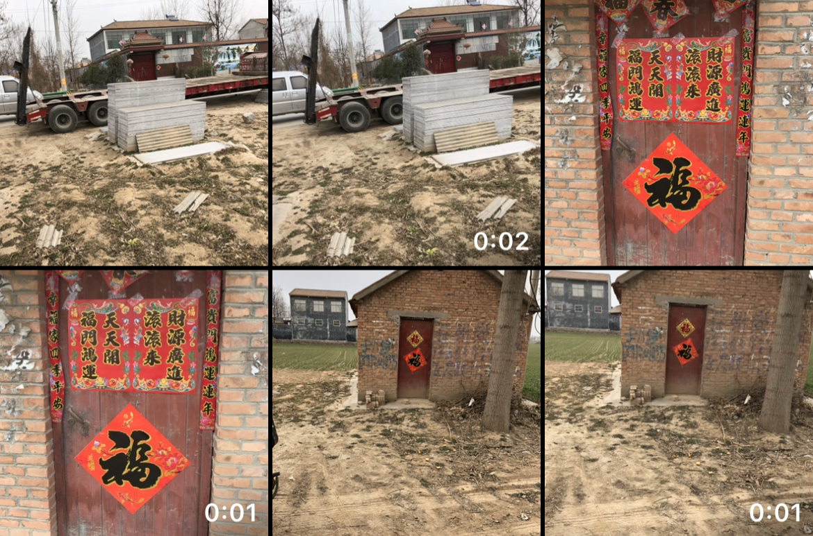

# DealGooglePhotosArchive

修复Google 相册导出时产生的Meta混乱，时间错乱，产生短视频等问题


## 前提

承接上一篇[《如何批量导出Google相册所有数据》](https://note.coccoo.cc/Archive/GooglePhotos-MultDown.html) ｜ [《如何批量导出Google相册所有数据》](./GooglePhotosExport.md) 
根据上一篇的方法导出的归档数据，往往许多信息都被抹除了，也就是Meta信息丢失，其中包括但不限于照片的`定位信息（经纬度）`、`拍摄时间`、`拍照设备`、`光圈`等一大堆信息。如果你默认下载了所有相册集，那么可能会有大量**重复**照片等着你，最可气的是如果你没有调整IOS设备的拍照格式的话，默认派出的都是`HEIC/HEVC`格式的内容，而Google恰恰又把IOS设备默认的`HEIC`格式照片直接处理成了一个`jpg`加一个2到3秒左右的`MOV`短视频，如果你使用`HEIC`拍摄了大量照片，那可能只能一个个手动在相册选择删除。

所以一般来讲，通过归档批量导出的数据，可能会遇到以下几种情况：

1. Meta信息丢失
2. 重复
3. 时间混乱
4. 多出大量的短视频

所以我一直在思考要如何处理这些问题。
首先是Meta信息丢失，直接导致了我把照片直接导入相册后时间线混乱，可能我昨天拍的照片会出现在`2007年`那一栏中，其次往往许多照片旁边伴随着一个`2秒短视频`，相册一眼望过去全是重复内容，让人苦恼不堪。

用Google search了一圈，发现网上有人提出问题，但是没人解决，痛定思痛，我决定写个小脚本批量处理，然后再导入手机。（最底下有完整代码，也已经放在Github上）

>  脚本是python写的，没怎么用过这个语言，本着实用主义原则，代码可能并不优雅

#### 重复照片

~~我仔细观察了一下，发现大量重复照片和视频的下载名称都相同，那就直接扫描文件夹，把重复文件剔除即可~~

根据文件的MD5直接把不同相册的相同图片作为重复文件移除，尽量确保留下的文件都不重复




```python
#处理重复
def dealDuplicate(delete=True):
    fileMD5List = {}
    dg = os.walk(scanDir)
    for path,dir_list,file_list in dg:
        for file_name in file_list:
            full_file_name = os.path.join(path, file_name)
            if file_name == '元数据.json':
                continue
            #处理重复文件
            _md5 = GetMD5FromFile(full_file_name)
            if _md5 in fileMD5List.keys() and full_file_name != fileMD5List[_md5]:
                DupDir = outPutDir + '/Duplicate/'
                if not os.path.exists(DupDir):
                    os.makedirs(DupDir)
                if delete:
                    os.remove(full_file_name) #这里可以直接删除
                else:
                    if not os.path.exists(DupDir + file_name):
                        shutil.move(full_file_name, DupDir)
                    else:
                        os.remove(full_file_name)
                print('重复文件：' + full_file_name + ' ------ ' + fileMD5List[_md5])
            else:
                fileMD5List[_md5] = full_file_name
    fileMD5List.clear()
```


#### 重复短视频

另一个就是大量`HEIC`转换出来的大量短视频，都是`.MOV`格式文件，这里我选择通过`ffmpeg`判断视频时长，进而把时长在`3s`以内的视频过滤出来，最终~~全部删除~~有选择地分门别类。



这里需要安装一下ffmpeg的扩展，`pip3 install ffmpeg-python`即可

**还有一点是需要提前安装好`ffmepg`可执行文件并配置好环境变量，否则有可能会报找不到ffprobe错误**

```python
#文件分类
def dealClassify():
    #部分文件变了，重新扫描
    g = os.walk(scanDir)
    for path, dir_list, file_list in g:
        for file_name in file_list:
            full_file_name = os.path.join(path, file_name)
            #处理时长低于3s的视频
            if os.path.splitext(file_name)[-1] == '.MOV':
                print('根据时长分类文件：' + full_file_name)
                info = ffmpeg.probe(full_file_name)
                #print(info)
                duration = info['format']['duration'] #时长
                if float(duration) <= 2:
                    under2Dir = scanDir + '/under2/'
                    if not os.path.exists(under2Dir):
                        print('创建文件夹：' + under2Dir)
                        os.makedirs(under2Dir)
                    if not os.path.exists(under2Dir + file_name):
                        shutil.move(full_file_name, under2Dir)

                elif 2 < float(duration) <= 3:
                    under3Dir = scanDir + '/under3/'
                    if not os.path.exists(under3Dir):
                        print('创建文件夹：' + under3Dir)
                        os.makedirs(under3Dir)
                    if not os.path.exists(under3Dir + file_name):
                        shutil.move(full_file_name, under3Dir)
            #处理HEIC文件
            elif os.path.splitext(file_name)[-1] == '.HEIC':
                heicDir = scanDir + '/HEIC/'
                if not os.path.exists(heicDir):
                    os.makedirs(heicDir)
                if not os.path.exists(heicDir + file_name):
                    shutil.move(full_file_name, heicDir)
            #单独存储json文件
            elif os.path.splitext(file_name)[-1] == '.json':
                jsonDir = scanDir + '/json/'
                if not os.path.exists(jsonDir):
                    os.makedirs(jsonDir)
                if not os.path.exists(jsonDir + file_name):
                    shutil.move(full_file_name, jsonDir)
                #print('处理json文件：' + full_file_name)
                #print('json文件：' + os.path.splitext(file_name)[-2] + '.json')
```

>  这里顺便筛选剔除了`HEIC`格式的照片，并把所有`json`文件单独放到一个文件夹备用


#### 修复Exif数据

谷歌把每一张照片原本的 Exif 数据（e.g. 地点、日期）抹掉，然后提取出来放到了对应的 JSON 里，另外目前版本看到的格式只有`xx.扩展`和`xx.文件扩展.json`这种命名方式的Meta文件，其他格式命名的没有做处理。

我这里的格式大概如下：

```json
{
  "title": "0b78c3d2f2313e3a958572ccc3e84f7e.MOV",
  "description": "",
  "imageViews": "2",
  "creationTime": {
    "timestamp": "1611595318",
    "formatted": "2021年1月25日 UTC 17:21:58"
  },
  "photoTakenTime": {
    "timestamp": "1527038024",
    "formatted": "2018年5月23日 UTC 01:13:44"
  },
  "geoData": {
    "latitude": 22.229499999999998,
    "longitude": 113.502,
    "altitude": 31.16,
    "latitudeSpan": 0.0,
    "longitudeSpan": 0.0
  },
  "geoDataExif": {
    "latitude": 22.229499999999998,
    "longitude": 113.502,
    "altitude": 31.16,
    "latitudeSpan": 0.0,
    "longitudeSpan": 0.0
  },
  "url": "https://video-downloads.googleusercontent.com/xxxxxxxx",
  "googlePhotosOrigin": {
    "mobileUpload": {
      "deviceType": "IOS_PHONE"
    }
  },
  "photoLastModifiedTime": {
    "timestamp": "1657342425",
    "formatted": "2022年7月9日 UTC 04:53:45"
  }
}
```


导出的文件中有部分是不存在`.json`元数据的，有些照片我的 Exif 丢了，有些照片则没丢，不清楚是否和勾选`原图上传`有关，所以脚本里要提前判断。

我这里用了`piexif`和`PIL`库，安装方式`pip3 install piexif`，`pip3 install Pillow`。

```python
#计算lat/lng信息
def format_latlng(latlng):
    degree = int(latlng)
    res_degree = latlng - degree
    minute = int(res_degree * 60)
    res_minute = res_degree * 60 - minute
    seconds = round(res_minute * 60.0,3)

    return ((degree, 1), (minute, 1), (int(seconds * 1000), 1000))
#读json
def readJson(json_file):
    with open(json_file, 'r') as load_f:
        return json.load(load_f)
#处理照片exif信息
def dealExif():
    g = os.walk(scanDir)
    for path,dir_list,file_list in g:
        for file_name in file_list:
            full_file_name = os.path.join(path, file_name)
            ext_name = os.path.splitext(file_name)[-1]
            if ext_name.lower() in ['.jpg','.jpeg','.png']:
                # if file_name != 'ee7db1e41afc9fd342e42e0a5034006b.JPG':   #   单文件测试
                #     continue

                if not os.path.exists(scanDir + '/json/' + file_name + '.json'):
                    continue
                exifJson = readJson(scanDir + '/json/' + file_name + '.json')
                print('处理Exif：' + full_file_name)
                try:
                    img = Image.open(full_file_name)  # 读图
                    exif_dict = piexif.load(img.info['exif'])
                except UnidentifiedImageError:
                    print("图片读取失败：" + full_file_name)
                    continue
                except KeyError:
                    print("图片没有exif数据，尝试创建：" + full_file_name)
                    exif_dict = {'0th':{},'Exif': {},'GPS': {}}

                # 修改exif数据
                exif_dict['0th'][piexif.ImageIFD.DateTime] = time.strftime("%Y-%m-%d %H:%M:%S", time.localtime(
                    int(exifJson['photoTakenTime']['timestamp']))).encode('utf-8')
                exif_dict['Exif'][piexif.ExifIFD.DateTimeOriginal] = time.strftime("%Y-%m-%d %H:%M:%S", time.localtime(
                    int(exifJson['creationTime']['timestamp']))).encode('utf-8')
                exif_dict['Exif'][piexif.ExifIFD.DateTimeDigitized] = time.strftime("%Y-%m-%d %H:%M:%S", time.localtime(
                    int(exifJson['modificationTime']['timestamp']))).encode('utf-8')
                exif_dict['GPS'][piexif.GPSIFD.GPSLatitude] = format_latlng(exifJson['geoDataExif']['latitude'])
                exif_dict['GPS'][piexif.GPSIFD.GPSLongitude] = format_latlng(exifJson['geoDataExif']['longitude'])
                # exif_dict['GPS'][piexif.GPSIFD.GPSLongitudeRef] = 'W'
                # exif_dict['GPS'][piexif.GPSIFD.GPSLatitudeRef] = 'N'
                exif_bytes = piexif.dump(exif_dict)
                img.save(full_file_name, None, exif=exif_bytes)

                #修改文件时间（可选）
                # photoTakenTime = time.strftime("%Y%m%d%H%M.%S", time.localtime(int(exifJson['photoTakenTime']['timestamp'])))
                # os.system('touch -t "{}" "{}"'.format(photoTakenTime, full_file_name))
                # os.system('touch -mt "{}" "{}"'.format(photoTakenTime, full_file_name))

                # print(type(exif_dict), exif_dict)
                # for ifd in ("0th", "Exif", "GPS", "1st"):
                #     print(ifd)
                #     for tag in exif_dict[ifd]:
                #         print(piexif.TAGS[ifd][tag], exif_dict[ifd][tag])
                # exit()

```


**修改下对应路径依次运行即可**

```
if __name__ == '__main__':
    scanDir = r'/Users/XXX/Downloads/Takeout' #TODO 这里修改归档的解压目录
    dealDuplicate()
    dealClassify()
    dealExif()
    print('终于搞完了，Google Photos 辣鸡')
```


#### 总结

`7K多个照片视频运行了大概2分钟跑完了`，最终运行一遍下来之后，多余的照片和视频已经处理掉了，那些`HEIC`已经被分成`JPG`+`MOV`的，程序把`MOV`视频剔除，所有照片已有的`Exif`已经修复了，代码中有一段修改`文件时间`的被我注释了，有条件的可以参考各自系统修改下`文件时间`就更好了。

把一路运行下来的坑都踩了一遍，如果有什么问题我再补充好了。

#### 完整代码

[https://github.com/tianyu211/DealGooglePhotosArchive](https://github.com/tianyu211/DealGooglePhotosArchive)